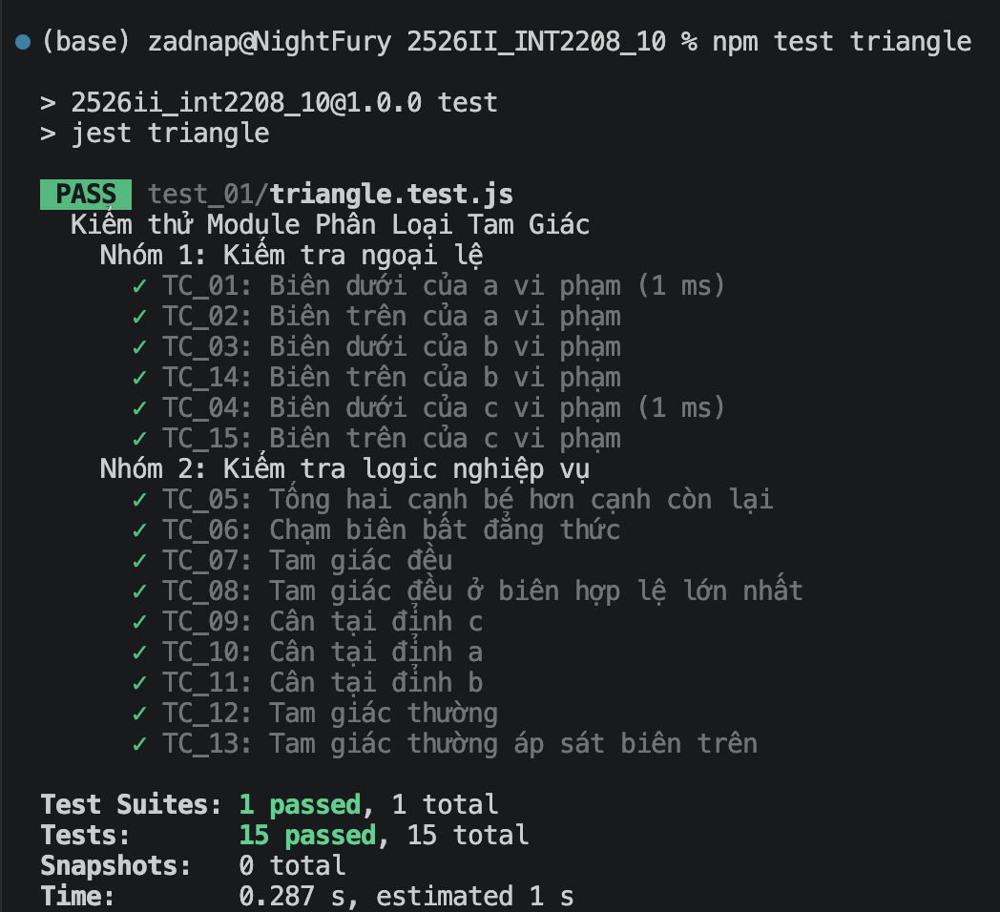

### Giới thiệu

Repository này chứa các bài tập về kiểm thử phần mềm cho môn Công Nghệ Phần mềm (Mã lớp: 2526II_INT2208_10) tại [Trường Đại học Công nghệ - Đại học Quốc gia Hà Nội](https://uet.vnu.edu.vn).

### Prerequisites

Hãy đảm bảo máy tính của bạn đã cài đặt sẵn các công cụ sau:

- [Node.js](https://nodejs.org/en)
- [Git](https://git-scm.com)

### Cài đặt và sử dụng

1. Clone repository

   ```bash
   git clone https://github.com/zadnap/2526II_INT2208_10
   cd 2526II_INT2208_10
   ```

2. Cài đặt các thư viện phụ thuộc

   ```bash
   npm install
   ```

3. Chạy kiểm thử

   ```bash
   npm test
   ```

### Kết quả kiểm thử

**_Bài kiểm thử 01: Phân loại tam giác_**


